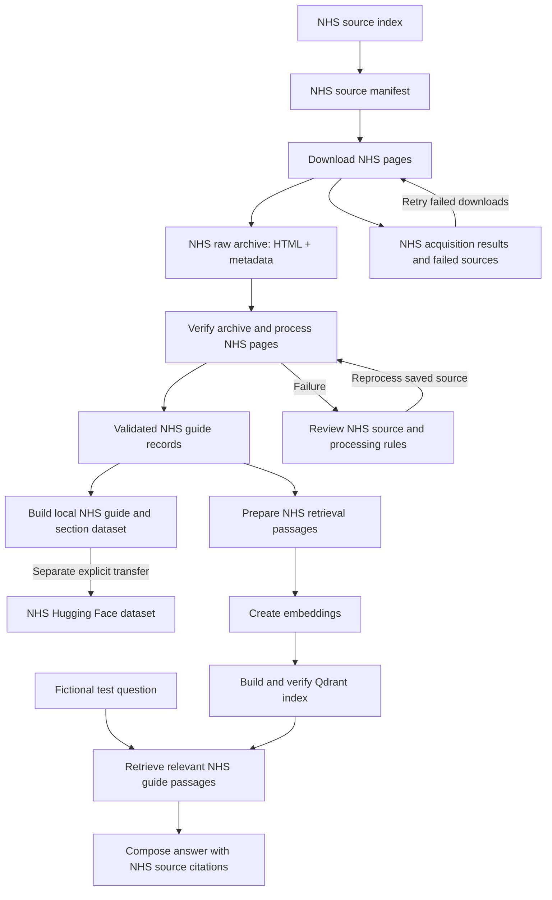
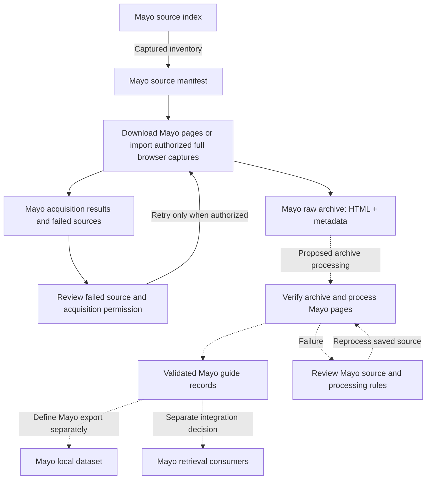

# Guide data workflow: sources → raw pages → guides → use

The shared boundary is the **raw archive**: save a source page and its provenance before
interpreting its content. Each publisher keeps its own source list and processing rules.
This document describes the stages and handoffs, not the extraction details.

The current change aligns Mayo acquisition with the NHS raw format. It does not run or
redesign Mayo processing. NHS already implements the downstream path; connecting the new
Mayo archive to processed guides and later consumers is separate work.

Publisher usage requirements apply before acquisition and every downstream stage. Read the
[NHS compliance review](nhs-dataset-compliance.md) and
[Mayo usage and compliance review](mayo-dataset-compliance.md). Mayo clearance is unresolved,
including local acquisition and AI use. The graphs describe software paths; they do not
authorize operating them. Existing code does not enforce the documented Mayo clearance hold.

## Processing graphs by source

Each publisher has its own acquisition results, processing review and downstream artifacts.
The two pipelines share the raw archive format described below. Solid arrows show existing
paths; dotted arrows show proposed handoffs.

### NHS processing graph

NHS implements the path from source discovery through guide processing, local dataset export
and retrieval. Hub transfer and index building are separate explicit operations.



### Mayo processing graph

The current Mayo acquisition job stops at the full raw archive. Processing that archive,
exporting its guides and connecting retrieval consumers remain proposed work. The earlier
experimental parser and files under `data/mayo/` are a separate path; they were not built
from this archive. The documented Mayo clearance hold applies to existing and proposed paths.



## Stage contracts

| Stage | Input → output | Responsibility |
| --- | --- | --- |
| Source selection | Publisher index → source manifest | Decide which URLs belong in the collection; keep publisher and population identity. NHS has live discovery; Mayo uses the tracked 45-guide inventory. |
| Acquisition | Manifest → raw archive and run results | Download or capture each selected page; record what was obtained and when. This stage does not extract guidance or decide clinical meaning. |
| Raw verification | Saved HTML + metadata → verified processing input | Check URL identity, archive version, byte length and checksum before using a saved page. |
| Source processing | Verified source → guide records | Apply the publisher-specific interpretation of the page. This is where source-dependent rules belong. |
| Guide validation | Candidate records → accepted records or reported failures | Validate the resulting guide contract and identify records requiring review. Schema validation alone does not establish extraction completeness. |
| Dataset export | Accepted guides → guide/section files and documentation | Produce a reproducible local dataset. NHS stops before export when ingestion or replay fails. |
| Optional transfer | Completed dataset → configured remote repository | Separate explicit operation; not part of acquisition or a local build. |
| Retrieval preparation | Guides → passages → embeddings → index | Build a retrieval representation separately from the source archive. |
| Use | Test question + retrieved passages → cited answer | Consume the prepared records. Answer generation never changes source archives. |

## Shared raw format

Both HTTP downloaders use `cronjobs/raw_archive.py`. The same reader checks saved HTML
against its metadata. Storage is local and Git-ignored:

```text
data/raw/
  nhs/<guide-slug>.html.gz
  nhs/<guide-slug>.metadata.json
  mayo/<symptom-and-population-slug>.html.gz
  mayo/<symptom-and-population-slug>.metadata.json
  mayo/download-report.json
```

The archive contains whole HTML, including navigation, references and embedded markup.
Removing or interpreting that content belongs to processing. Linked images, videos and
other media bytes are not bundled. For Mayo the filename uses the symptom plus population;
the common `itt-20009075` suffix cannot identify individual guides.

Each metadata file records the archive version, requested/final URL, original acquisition
time, encoding, content type, byte length and SHA-256. HTTP records additionally retain
status, redirect history, request user agent and response headers, including cache validators.
New archives explicitly record their acquisition method and full-document scope. Existing
NHS version-1 archives without these additional fields remain readable.

HTTP content is the response body after HTTP content decoding. Browser content is a serialized
full DOM, labelled `acquisition: browser_dom`; it is not original response bytes. Unobserved
HTTP status, redirects and request headers remain null/empty. Browser captures must contain
`html`, `head` and `body`, and retain their observed final URL and original capture timestamp.
Old Mayo `.symptomchecker` fragments are retained as earlier experimental inputs, but are
not accepted as full raw pages.

The initial aligned Mayo archive contains all 45 full guide pages, captured through the
browser because direct HTTP access returned 403 in this environment. The current live index
was checked against the tracked manifest before capture. These records have checksums and
full page markup; they do not claim unobserved HTTP provenance.
The reported 403-to-browser acquisition history remains a compliance review issue, not an
approved way to bypass denied access. See the Mayo review before further collection.

## Acquisition commands

The Mayo commands are implementation references for use after recorded clearance, including
offline imports. Download capability and archive validation do not establish permission.

```bash
# Mayo: download only, with no guide parsing, exports or indexing
uv run python -m cronjobs.mayo_dataset --contact "mailto:you@example.com"

# Mayo: import full browser captures without network access
uv run python -m cronjobs.mayo_dataset --from-browser data/raw/mayo/browser-captures

# NHS: existing download/archive/parse workflow
uv run python -m cronjobs.nhs_dataset.refresh --contact "mailto:you@example.com"

# NHS: existing offline process/export workflow
uv run python -m cronjobs.nhs_dataset --from-raw
```

Mayo supports `--manifest-path`, `--raw-dir`, `--contact`, `--delay`, `--force`, and
`--from-browser`. Defaults resolve from the repository root. Browser capture inputs are
`<slug>.json` objects containing `requested_url`, observed `final_url`, timezone-aware
`fetched_at`, and full-document `html`. For an authorized capture, verify the corresponding
page and observed URL before import. The importer never launches or controls a browser.

HTTP acquisition uses the manifest allowlist, checks robots.txt, fetches sequentially,
retries transient failures and records failures per source. Conditional requests require a
checksum-verified HTTP archive. A 304 retains the original copy date. Browser captures never
supply invented HTTP validators. Mayo refuses redirects for source review before another
request is sent; NHS retains its existing redirect behavior.

## Refresh and reprocessing

A source change requires acquisition, then a separate processing run. A change to processing
rules should use the existing verified archive, retaining its original acquisition date.
Rebuilding an export does not refresh the source or rebuild the index. Index rebuilding is
an explicit downstream operation.

Failed requests preserve previous raw files and make the Mayo command exit nonzero. Consult
`download-report.json` before treating a refresh as complete. Successful downloads may update
other raw files in the same run. As with NHS, individual file replacements do not make the
whole archive a transactional, historical snapshot; coherent builds remain BL-007 work.

For Mayo, the command stops at the raw archive. Earlier experimental parsed files under
`data/mayo/` are unchanged and are not rebuilt from this new archive yet. The legacy parser
CLI is not the acquisition entry point. Further guide processing, exports and retrieval
integration remain separate decisions based on the source data.

Implementation: [shared archive](../cronjobs/raw_archive.py),
[Mayo acquisition](../cronjobs/mayo_dataset/downloader.py),
[NHS workflow](nhs-dataset-workflow.md). The central [backlog](../backlog.md) records unfinished work.
