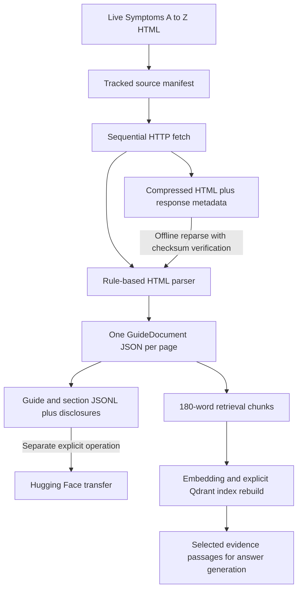

# NHS dataset creation workflow and extraction specification

Specification version: 1.1. Reviewed against the working tree and local archive on
7 September 2026. Current parser version: `3`; raw archive version: `1`.

This document describes the executable workflow and gives humans a basis for reviewing
extraction decisions. **Current behavior** describes code that exists. **Proposed** decisions
are not implemented or approved by this document. Source code is the authority when it and
the document disagree; update the document alongside future implementation changes.

The project is for local LLM testing and learning RAG with fictional questions. Public,
personal-health and clinical use are outside its scope. This document neither expands that
scope nor authorizes downloading media or publishing a dataset. Content-rights findings are
in the separate [compliance review](nhs-dataset-compliance.md).
Work status is tracked centrally in [backlog.md](../backlog.md). Strict main selection is
implemented (BL-001); multimedia review is explicitly deferred (BL-002).

## 1. Workflow, ownership and artifacts

The workflow already exists in `cronjobs/nhs_dataset/`. It is a manually invoked job; the
directory name does not mean a scheduler has been configured. The backend consumes completed
artifacts and does not perform website discovery or extraction during a chat request.



No language model, OCR, speech recognition or browser JavaScript execution is used to create
the parsed dataset. The model is used later for answer synthesis.

| Artifact | Default repository-relative location | Contract |
| --- | --- | --- |
| Source manifest | `config/nhs_sources.json` | Tracked URLs, labels, aliases and discovery metadata. |
| Hub configuration | `config/huggingface.local.json` | Ignored destination configuration; no credentials. |
| Raw page | `data/raw/nhs/<slug>.html.gz` | Gzip of HTTPX response bytes after HTTP content decoding. Not a browser DOM snapshot or screenshot. |
| Raw provenance | `data/raw/nhs/<slug>.metadata.json` | Response details and checksum for offline replay. |
| Parsed page | `data/nhs/<slug>.json` | Validated `GuideDocument`; application input. |
| Dataset repository | `data/huggingface/nhs_symptom_guides/` | `README.md`, `NOTICE.md`, `metadata.json`, `data/guides.jsonl`, `data/sections.jsonl`. |
| Retrieval index | Configured standalone Qdrant collection | Vectors and chunk payloads; built separately. |

Paths are resolved relative to the repository root in `paths.py`, not the shell's current
directory. Raw and derived data are Git-ignored. A filename uses only the final URL path
segment: different URLs sharing a last segment can collide. There is no collision guard in
the downloader. The archive stores the latest successful body per slug, not a version history.
Raw HTML includes image references, alt text, captions and scripts; media files themselves
are not fetched by this workflow.

## 2. Commands and operating modes

Run from the repository root after installing locked Python dependencies with
`uv sync --dev`. Python requirement is `>=3.11`; use the lockfile for exact library versions.

| Goal | Command | Network and output |
| --- | --- | --- |
| Discover, fetch, parse and export | `uv run python -m cronjobs.nhs_dataset --contact "mailto:you@example.com"` | NHS HTTP requests; updates manifest, raw, parsed and exported data. No upload. |
| Fetch the existing manifest and export | `uv run python -m cronjobs.nhs_dataset --skip-discovery --contact "mailto:you@example.com"` | NHS requests; retains source selection. |
| Refresh only raw and parsed pages | `uv run python -m cronjobs.nhs_dataset.refresh --contact "mailto:you@example.com"` | NHS requests; does not regenerate JSONL or Qdrant. |
| Reparse and export from saved HTML | `uv run python -m cronjobs.nhs_dataset --from-raw` | No NHS access; preserves original fetch timestamps. |
| Export existing parsed pages only | `uv run python -m cronjobs.nhs_dataset --skip-discovery --skip-download` | No NHS access or reparsing. Both flags matter. |
| Build retrieval index | `uv run python -m nhs_rag.retrieval.cli` | Uses configured Qdrant and embedding model; may download model weights if absent. Replaces the named collection. |

Full job options:

- `--contact`: identifying contact; default is a project GitHub URL, not proof it is monitored.
  Supply a real monitored contact for a live run.
- `--delay`: seconds between guide requests, default `1.0`; CLI clamps negative values to zero.
- `--force`: omit conditional fetch headers; does not alter discovery or export rules.
- `--skip-discovery`: retain the existing manifest.
- `--skip-download`: use parsed data; **alone it still performs live discovery**.
- `--from-raw`: bypass discovery and downloads, reparse then export. Mutually exclusive with
  `--skip-download`; `--force` has no effect on offline input.
- `--manifest-path`, `--hub-config`, `--raw-dir`, `--corpus-dir`, `--output-dir`: override the
  paths above. A missing Hub configuration uses an unset namespace and private default.

The refresh-only CLI has `--contact`, `--delay`, `--force`, `--manifest-path`, `--raw-dir`,
`--corpus-dir`, and `--limit`. Limit selects the first N manifest entries; nonpositive values
select none. Its default contact is a localhost URL, so override it for live requests.

Hub operations are separate: `python -m cronjobs.nhs_dataset.hub [--hub-config PATH]
[--dataset-dir PATH] upload [--commit-message TEXT]` or `download [--revision REF] [--force]`,
normally invoked through `uv run`. Global options go before the subcommand. They require a
namespace; `dataset_name` defaults to `nhs-symptom-guides`, `private` to `true`. Credentials
come from the Hugging Face environment/credential store, not configuration JSON. Transfer
does not constitute rights clearance and is not part of an offline build.

## 3. Discovery and source selection

Implementation: [discovery.py](../cronjobs/nhs_dataset/discovery.py),
[urls.py](../cronjobs/nhs_dataset/urls.py).

1. Request robots.txt using `GuidePostHealthDataset/0.1 (+<contact>)`; check whether the
   Symptoms index is allowed, then request `https://www.nhs.uk/symptoms/`.
2. Parse the selected main region. A one-letter alphabetic `h2` starts an index letter group;
   another `h2` clears it. Read the first link in each subsequent `li` while a letter is active.
3. Normalize whitespace. A label matching `term, see target` is a cross-reference; retain
   the full label but use its first term as the searchable term. Resolve relative links.
4. Group entries by exact resolved URL, preserving encounter order. Prefer a non-cross-reference
   term for the guide title. Build case-insensitively deduplicated aliases; retain all original
   index entries. This is URL grouping, not semantic deduplication of medical content.
5. Atomically write the manifest through a temporary file. Empty index extraction fails.

Manifest fields: `licence`, `discovery_source`, `discovered_at`, `scope`, `index_entry_count`,
`unique_guide_count`, `sources`. Each source has `title`, `url`, `aliases`, `index_terms`,
`index_entries`; each index entry has `letter`, `label`, `term`, `url`, `cross_reference`.
These are discovered entries, not evidence of manual or clinical review.

URL validation requires HTTPS, exact `www.nhs.uk`, no user/password/explicit port, and a
normalized decoded path under `/symptoms/`, `/conditions/`, `/mental-health/` or `/pregnancy/`.
Queries, fragments, remaining percent encodings and backslashes are rejected. Checking
normalized paths does not rewrite stored URLs. A valid path is not a licence determination.

Discovery retries HTTP failures up to three attempts with waits of one and two seconds;
it does not implement the guide fetcher's special `429` handling. Discovery validates the
final index URL. The live index HTML and robots response are not archived, so exact historical
discovery replay depends on the saved manifest, not a saved index page.

## 4. Download, archive and replay

Implementation: [downloader.py](../cronjobs/nhs_dataset/downloader.py).

The guide downloader loads/validates the manifest, checks robots.txt, and visits each source
sequentially with `GuidePostHealthRAG/0.1 (+<contact>)`. HTTPX timeout is 30 seconds with a
10-second connection timeout. It follows redirects automatically and checks all URLs in
the returned history and final response. **This is post-request validation, not prevention
of the redirect request itself.** Robots permission is checked on the requested guide URL,
not separately for each redirect target. The main-page parser separately validates canonical URLs.

Guide request failures and 5xx responses are retried up to three times with exponential
backoff. A `429` sleeps for numeric `Retry-After` (default two seconds, capped at 30); an
HTTP-date value is not supported. Other HTTP errors reach the outer failure handler. There
is no response-size limit or explicit HTML Content-Type enforcement before parsing.

When a valid old parsed file and both archive files exist, its ETag/Last-Modified are sent
as `If-None-Match`/`If-Modified-Since`, unless forced. A `304` increments `unchanged` without
updating the original fetch timestamp, reparsing, or recording a new verification timestamp.
Parser changes therefore require offline reparse or a forced fetch, not just an ordinary refresh.

For a successful new body:

1. Set a UTC fetch timestamp; gzip response bytes at compression level 9.
2. Save metadata: archive version, requested/final URLs, redirect chain, status code, fetch
   timestamp, encoding, media type, SHA-256 of uncompressed bytes, byte length, request user
   agent and all response headers with lowercase keys.
3. Parse `response.text` using the same fetch timestamp and HTTP validator fields.
4. Serialize parsed JSON through `.json.tmp` and replace the destination.

Individual files use temporary replacement. The raw body, raw metadata and parsed page are
**not one transaction**. A crash can leave a mismatched raw pair; a parse failure can leave
new raw HTML alongside the old parsed document. Errors are collected by source and the job
continues, then exits nonzero. Full-job export is skipped if ingestion/reparse reports any
failure; previously generated outputs remain on disk and must not be mistaken for a new build.

Offline replay requires both archive files, archive version `1`, exact requested-URL match,
an allowed final URL and a matching raw-body checksum. It decodes the recorded encoding,
passes the recorded fetch timestamp and validators into the parser, then writes parsed JSON.
No original fetch date is replaced with today's date. Checksums detect mismatch/corruption;
they are not signatures establishing authenticity. Saved redirect history is not revalidated.

## 5. Main-region selection and metadata

Implementation: [content.py](../cronjobs/nhs_dataset/content.py), shared by
`parse_nhs_page()` and `parse_symptom_index()`.

BeautifulSoup uses Python's `html.parser`. Both entry points require:

```python
main = require_main_content(soup, url=source_url)
```

The shared helper requires exactly one `main#maincontent` match and exactly one `main`
element in the document. A missing/renamed ID, wrong element type, duplicate matching region,
or additional main raises `UpstreamSchemaError` (a `ValueError` subclass). The message names
the URL, expected selector and observed counts and asks for source-template review. There
is no generic-main, body or article fallback, nor an option to bypass the requirement.

Guide fetching/replay records this exception in the per-source error report, preserves the
previous parsed file, continues checking other guides, and makes the run exit nonzero. The
full job does not export if any page failed. Discovery raises before replacing the manifest.
Existing outputs can remain on disk; nonzero status must not be treated as a fresh build.
Raw HTML is already archived before a live guide's parse fails, making review possible.

**Implemented decision D-01 / BL-001:** remove silent fallback. All 138 saved guides have
exactly the required main region, so this change does not alter their extracted text. Main
selection validates this particular upstream contract; it does not detect every possible
change to headings, tables or other descendants. Those remain separate review items.

The guide parser also rejects main text containing `registered medical device`; this heuristic
is neither exhaustive nor a clinical classifier.

Metadata extraction is separate from passage extraction:

| Field | Exact source and precedence |
| --- | --- |
| Structured metadata | Recursively search parsed `application/ld+json` scripts for the first `MedicalWebPage` node; skip malformed JSON. |
| Canonical URL | First `link[rel="canonical"]` href, otherwise metadata URL, otherwise requested URL; resolve relative to requested URL and validate. |
| Title | First `h1` in main, otherwise metadata `name`; normalize whitespace; fail if empty. |
| Description | Metadata `description`, interpreted as an HTML fragment and stripped to normalized text; null unless a nonempty string. |
| Modified date | Metadata `dateModified`, converted to a string when present. |
| Review dates | Regex for `Page last reviewed:` and `Next review due:` followed by day, English month word and four-digit year; searched in remaining whole-document text after extraction. |
| Fetch time, ETag, Last-Modified | Supplied by downloader/replay, not inferred from the page's review date. Direct parser calls without a fetch time use current UTC. |

Review dates remain strings, not validated dates. A review date is not the fetch date.
Description and titles do not receive separate third-party-rights detection. The canonical
URL is resolved against the original request even after a redirect, not against the final URL.

## 6. Removal and the multimedia tradeoff

Before text traversal, `decompose()` deletes these elements **and their descendants**:

```text
script style svg form nav picture figure img video audio iframe
noscript canvas object embed
```

This reduces navigation noise and unsupported interactive content, and avoids carrying
image/media markup into a text-only corpus. It does not establish that the remaining text
is fully licensed or semantically complete. Content can be useful and still need separate
reuse permission; usefulness and permission are different review questions.

| Removed or unsupported material | What downstream loses | Review implication |
| --- | --- | --- |
| Images, diagrams and SVG | Appearance, body location, comparisons, spatial relationships and visual instructions. Image alt attributes are not extracted. | Text-only retrieval cannot answer questions requiring those visuals. |
| Whole `figure` | Captions, credits and any descendant guidance, not just the image. | Some ordinary text facts disappear with the image container. |
| Video/audio/embedded players | Spoken advice, demonstrations, gestures, timing and fallback text nested in the player. | No transcription or media interpretation is performed. |
| `noscript`, object and canvas fallback | Accessible alternative descriptions or instructions. | Removing executable/embedded functionality can also remove useful alternatives. |
| Forms/widgets | Inputs, question order, branching and generated results. | Never treat flattened widget text as equivalent to the interactive service. |
| Navigation | Usually menus, but potentially local contextual links. | Confirm selected navigation does not contain needed qualifiers. |

Observed in the 138-page archive: 102 figures on nine pages, 128 image elements on nine
pages, 62 figcaptions on seven pages, and 17 video elements on 17 pages. Counts include
repeated/responsive elements and are not counts of unique media assets. No main-region
audio, iframe or form elements were found. The 26 pages with image/video markup do not
tell us whether a particular recommendation depends on that media.

Concrete loss: `nail-problems` has four captions describing nail appearances and possible
associations. Each caption is absent from the parsed section text. For example, the caption
about spoon-shaped nails contains an association that is removed with its figure. This is
evidence of omitted information, not an evaluation of the medical claim.

**Deferred decision D-02 / BL-002:** review later whether to retain media references, alt text, captions, adjacent heading
context and credit/rights evidence in a separate local review representation. Classify each
item before placing any of it into retrievable text. Keep licensed standalone explanatory
text when a reviewer confirms it makes sense without the visual; mark visual-dependent
passages so retrieval does not treat them as self-contained. Only acquire/transcribe assets
with appropriate rights and an explicit need, retaining authorship and review provenance.
Do not automatically describe images with an LLM or call generated descriptions NHS text.

The raw HTML already preserves much of this review material, so it can be revisited without
refetching the page. It does **not** preserve media bytes or necessarily any transcript loaded
by JavaScript. The current guide/section schemas have no media-omission flags or review fields.

## 7. Text and section extraction rules

Implementation: `_extract_sections()` and `_urgency_for()` in `parser.py`.

1. Start an implicit `Overview` section, urgency `general`.
2. Traverse all descendants matching `h1`, `h2`, `h3`, `p`, `li`, `dt`, `dd` in document order.
3. Skip `p` inside any `li` because the list item's descendant text already includes it.
   Skip `dt`/`dd` nested inside an ancestor with the same tag. Nested list items are not
   similarly excluded and can duplicate content contained in their parent item.
4. Use `get_text(" ", strip=True)`, collapse every whitespace run to one space, strip edges.
   Empty strings are skipped. Inline markup is flattened; anchor text survives, hrefs do not.
5. A matching page-title `h1` is skipped. Other selected headings flush the previous section
   and start a new heading. Heading levels/hierarchy are not stored.
6. Prefix list and definition entries with `• `. Other retained blocks become ordinary lines.
7. Flush by deduplicating identical nonempty lines within the section, preserving first
   occurrence, and joining them with newlines. This does not deduplicate whole sections.
8. Finally discard sections whose combined text has fewer than 20 characters or whose heading
   starts with `video:` or `audio:` case-insensitively. This can discard meaningful short
   instructions or a text transcript under such a heading.

Tags not selected are not necessarily deleted. Their selected descendants can still contribute
text. In particular:

- `table`, `caption`, `tr`, `th`, `td` are not modeled. Paragraphs/lists inside cells can
  survive, but headers and row/column relationships are lost; plain cell text can vanish.
  There are **52 tables on 44 pages**. Saying all table text is removed is too broad.
- `details` bodies contribute selected descendants even when initially collapsed, but
  `summary` is not selected, so the expander's label/context can be lost. There are 86 details
  elements on 35 pages.
- `h4–h6` are not selected; 18 such headings appear on six pages.
- CSS visibility is not evaluated. Visually hidden words inside a selected heading (such as
  an urgency prefix) can be useful and are retained. The parser is not a visual page renderer.

Urgency checks examine an element and up to three ancestors' classes, plus the active heading.
The current order is emergency phrases/classes first, **routine second**, urgent third, then
general. Thus overlapping routine and urgent indicators within one check may classify as
routine. As subsequent blocks are processed, the section retains the highest candidate rank
(`general < routine < urgent < emergency`). Those two orderings are different; review both.
No separate classification confidence, clinical validation or label explanation is stored.

Synthetic example illustrating transformation, not clinical advice:

```html
<main id="maincontent">
  <h1>Example guide</h1>
  <h2>Read before starting</h2>
  <p>Follow the instructions in the <a href="/example/">full guide</a>.</p>
  <figure><figcaption>Additional context.</figcaption></figure>
</main>
```

```json
{
  "heading": "Read before starting",
  "text": "Follow the instructions in the full guide .",
  "urgency": "general"
}
```

Notice the space before the punctuation from HTML flattening, missing href, and lost caption
and alt text. The paragraph passes the 20-character threshold. Such formatting is deterministic,
but determinism alone does not mean faithful extraction.

## 8. Parsed schema, hashes and export contract

Implementation: [models.py](../backend/nhs_rag/models.py),
[exporter.py](../cronjobs/nhs_dataset/exporter.py).

| GuideDocument field | Type / meaning |
| --- | --- |
| `requested_url`, `canonical_url` | Pydantic HTTP URLs; parser applies additional NHS path validation. |
| `title` | String; parser requires nonempty. |
| `description` | Optional string; JSON-LD description. |
| `fetched_at` | Datetime, serialized as ISO 8601. |
| `date_modified`, `last_reviewed`, `next_review_due` | Optional strings. |
| `etag`, `last_modified` | Optional HTTP validator strings. |
| `content_sha256` | SHA-256 of ordered section model dictionaries serialized with sorted keys and `ensure_ascii=False`. |
| `parser_version` | Parser supplies `3`; the shared model's backwards-compatible default remains `1`. |
| `licence` | Defaults to `Open Government Licence v3.0`; not a per-page rights decision. |
| `sections` | Ordered list of `{heading: str, text: str, urgency: general/routine/urgent/emergency}`. |

The section-content hash covers headings, text, urgency and order. It does not cover title,
description, URL, fetch date, licence or parser version. The raw archive's identically named
`content_sha256` instead hashes raw HTML bytes. Do not compare those two hashes as if they
represented the same object. Direct schema validation is weaker than the parser's checks:
e.g. schema-valid empty sections or a default parser version are possible.

Export follows manifest order and loads each expected slug file. It rejects a missing/invalid
document, requested-URL mismatch, disallowed canonical URL, unexpected licence string, or
duplicate canonical URL. An empty manifest is not handled explicitly and fails when calculating
copy dates. It does not audit extraction completeness, enforce parser-version uniformity or
cryptographically verify the stored parsed hash.

**Guide JSONL fields:**

- Identity: `id` (first 20 hex characters of canonical-URL SHA-256), manifest `title`,
  extracted `page_heading`, `terms`, `aliases`, `index_terms`, `index_entries`.
- Content: requested `url`, `canonical_url`, `description`, `sections`, and `text` formed as
  `heading + newline + section text`, with blank lines between sections.
- Reuse: `language` = `en`, `geographic_scope` = `England`, `source` = GuidePost adapted
  extract, `original_publisher`, `attribution`, `adaptation_notice`, `licence_url`, `terms_url`,
  `licence`.
- Provenance: `fetched_at`, `date_modified`, `last_reviewed`, `next_review_due`,
  `content_sha256`, `parser_version`.

`terms` removes exact duplicates from manifest title, page title and aliases. These terms
are included in export but not in the current backend's embedding string.

**Section JSONL fields:** `id` = `guide_id:zero_based_section_index`, `guide_id`, `title`,
`terms`, `aliases`, `url`, `canonical_url`, `heading`, `text`, `urgency`, `language`,
`geographic_scope`, `source`, `original_publisher`, `attribution`, `adaptation_notice`,
`licence_url`, `terms_url`, `licence`, `fetched_at`, `last_reviewed`, `content_sha256`.
The last field is the parent guide's section-content hash, not a hash of that individual row.
Flat section records currently omit `parser_version`, description and next-review date.

The card declares `guides` and `sections` configurations, each with a loader-compatible
`train` split. This is one unsplit reference corpus, not a training recommendation or held-out
evaluation set. The YAML size category is fixed, not computed independently for each config.

`metadata.json` includes guide/section/index counts, earliest/latest fetch strings, attribution,
adaptation/terms/licence links, pending rights status, local learning intended use, discovery
source, licence and configured Hub destination/visibility. Date min/max is calculated over
ISO strings; the current UTC inputs are consistent, but mixed offsets would need datetime
normalization. A configured private destination does not verify existing remote visibility.

JSONL files use UTF-8, compact JSON, one record per line and temporary-file replacement.
Card, notice and build metadata use direct writes. The bundle is not atomically promoted.
Generated metadata has no build ID, dependency-lock hash, parsed-input manifest hash or reviewer
sign-off. Dataset IDs alone do not identify a content version; a section insertion shifts IDs.

Hub validation checks the five expected files exist and positive integer counts in metadata.
It does not validate every JSONL row, recompute counts/hashes, enforce rights review or remove
older unrelated remote files. Upload uses an explicit allowlist; raw/parsed input files are
excluded. Download does not populate `data/nhs/` or build the backend's index.

## 9. What downstream code actually uses

Implementation: [chunker.py](../backend/nhs_rag/retrieval/chunker.py),
[retrieval/service.py](../backend/nhs_rag/retrieval/service.py),
[agent/prompt.py](../backend/nhs_rag/agent/prompt.py).

The backend reads sorted `data/nhs/*.json`, **not** the Hugging Face exports or only the
manifest's current entries. Invalid documents are silently skipped; no valid documents is
an error. Withdrawn/orphaned valid files can therefore remain indexed unless explicitly removed.

Each section is split by whitespace into windows of at most 180 words with a 28-word overlap,
stride 152. Short sections retain their original text/newlines; long sections are joined
with spaces. Boundaries are not sentence-aware. Every chunk receives title, heading, URL,
fetch timestamp and section urgency. UUIDv5 uses the fixed project namespace and a string
containing canonical URL, section index, heading, chunk index and chunk-text SHA-256.

The embedding input is `title + newline + heading + newline + chunk text`; the configured
Sentence Transformer (default `all-MiniLM-L6-v2`) produces normalized vectors. A model's token
limit is separate from the word limit and may truncate the embedding input. Qdrant stores
the full chunk payload alongside its vector and uses cosine similarity. The explicit index
command deletes/recreates the configured collection, writes batches of 128, verifies count,
and records schema/corpus/model/vector-size/chunk-count metadata. API startup checks this
metadata against local chunks; no automatic reindex follows dataset export.

Retrieval defaults to six matches, appends unseen urgent/emergency chunks from documents
represented by the top three matches, then caps evidence at nine. The cap can omit added
safety chunks. Answer synthesis receives IDs, titles, section headings, urgency and selected
text, plus the question and last six history messages. It does not receive raw HTML, image
content, URLs, fetch dates, complete pages, or the dataset's full licence metadata.

Generated next steps/warnings must cite supplied evidence IDs; this validates references,
not factual entailment. The server builds source links/disclosures separately. On agent
failure, selected passages are shortened to 360 characters; citation excerpts to 220.
Both truncation and upstream extraction can lose context. Fixed emergency handling can bypass
retrieval and does not demonstrate what was retrieved from this corpus.

Observed local build: 205 index entries → 138 documents → 1,199 sections → 1,221 chunks.
These are observations, not fixed success criteria or a claim about a running Qdrant instance.
Raw fetches are from 6 September 2026; offline processing does not make the information newer.

## 10. Human review decisions and acceptance criteria

The completed main-selection decision and remaining review proposals are listed below.
[backlog.md](../backlog.md) owns status and prioritization. Multimedia review is deferred;
the other proposals are not automatically selected for implementation.

| ID | Proposed decision | Evidence a reviewer should require |
| --- | --- | --- |
| D-01 / BL-001 | Implemented: strict main selection without fallback. | Exactly-one-main check; missing/renamed/wrong-tag/duplicate/extra-main fixtures for both entry points; URL and counts in errors; failed reparse blocks export and preserves prior parsed output. |
| D-02 / BL-002 | Deferred: review media removal and useful licensed explanatory text. | Local inventory of media, captions/alt/transcripts, credits and surrounding headings; explicit decision whether retained text stands alone. No automatic media acquisition. |
| D-03 | Preserve tables as header/row/cell relationships. | Before/after review of all 52 current tables; fixtures for plain cells, paragraph cells, spans and nested lists. No headings or qualifiers silently detached. |
| D-04 | Preserve heading and expander context; reconsider short-section filtering and deduplication. | Fixtures for h4–h6, summary/details, nested lists, repeated instructions and short warnings; report of discarded text. |
| D-05 | Make urgency rules auditable. | Overlapping routine/urgent marker tests; per-label reasons and review of disagreements. Heuristic outputs remain labelled as such. |
| D-06 | Record immutable build provenance and extraction losses. | Raw/parsed hashes, selector, parser/lock versions, removed-element and missing-content counts, original fetch and verification timestamps, and artifact-level checksums. |
| D-07 | Make builds complete and coherent. | Slug-collision detection, orphan handling, mixed-version rejection, staging/promotion, interrupted-run recovery and input/output count checks. |

Suggested human review procedure:

1. Identify the exact manifest, archive hashes and parser version. Reproduce into a separate
   directory; do not overwrite the baseline being compared.
2. Compare raw source structure with parsed output and the final retrieval chunks. Sample
   ordinary pages and inspect every flagged table/media/heading anomaly. A browser view can
   help review a local page, but remote assets may not render offline.
3. Check qualifiers, negation, age/context, list boundaries, table relationships, urgency
   wording and meaningful short text. Record losses and whether they bias the learning task.
4. Check licensing/provenance separately from usefulness; original NHS publication does not
   grant this project rights to all embedded material. Use the existing rights inventory.
5. For each finding record reviewer, date, source URL, raw hash, parser version, affected
   section/chunk, reason, decision and follow-up. No human sign-off is implied by this document.

Acceptance evidence for a proposed parser revision should include unchanged-source replay,
expected output diffs, explicit counts of omitted material, and tests for the affected rules.
A clean test run does not establish lossless extraction; tests must cover what is being lost.
After a parser change, regenerate and review exports, then explicitly rebuild any index used
for the experiment. Preserve the original fetch dates throughout.

## 11. Reproduction and existing verification

For an isolated offline comparison:

```bash
uv run python -m cronjobs.nhs_dataset --from-raw \
  --corpus-dir /private/tmp/guidepost-review-corpus \
  --output-dir /private/tmp/guidepost-review-dataset
uv run pytest tests/test_nhs_dataset_job.py tests/test_retrieval.py tests/test_chat_service.py
```

Use fresh temporary paths for each comparison. Offline replay still needs the original local
archive and manifest. Exact reproduction also depends on parser/dependency versions and
export configuration; the current build metadata does not record all of these automatically.

Existing tests cover section/urgency extraction on a fixture, media removal, unsafe URLs,
index deduplication, export records/disclosures, mixed copy dates, Hub file allowlisting,
raw offline replay, excluded canonical URLs, registered-device markers and strict main-schema
failure handling in both guide and index extraction. They do not yet
establish complete table/caption/heading preservation,
transactional builds or a clinically correct urgency classifier.

Version 1.0 validation reproduced 138 guides and 1,199 sections with parser 2. Version 1.1
implements strict selection in parser 3 and adds schema-change regression tests. The existing
[rights inventory](nhs-content-inventory.json) remains a historical parser-2 audit, not a new
rights approval. Multimedia extraction has not changed.
Parser-3 verification: all 138 archived guides reparsed with zero failures into 1,199 sections;
every parsed field other than `parser_version` matched the previous corpus. Local exports
were regenerated offline. All 45 Python tests, lint and strict type checks passed.

The archive measurements in sections 5–7 can be repeated without network access:

```python
import gzip
from collections import Counter
from pathlib import Path
from bs4 import BeautifulSoup

counts = Counter()
for path in sorted(Path("data/raw/nhs").glob("*.html.gz")):
    soup = BeautifulSoup(gzip.decompress(path.read_bytes()), "html.parser")
    exact, mains = soup.select("main#maincontent"), soup.select("main")
    counts["pages"] += 1
    counts["exact_main"] += bool(exact)
    counts["fallback_needed"] += not exact and bool(mains)
    counts["multiple_main"] += len(mains) > 1
    if not (exact or mains):
        continue
    main = (exact or mains)[0]
    for selector in ("figure", "img", "figcaption", "video", "audio", "iframe",
                     "form", "table", "details", "h4,h5,h6"):
        elements = main.select(selector)
        counts[f"{selector}:pages"] += bool(elements)
        counts[f"{selector}:elements"] += len(elements)
print(dict(counts))
```

## 12. Implementation map

| Module | Responsibilities |
| --- | --- |
| [cli.py](../cronjobs/nhs_dataset/cli.py) | Full-job modes, orchestration, error exit before export. |
| [refresh.py](../cronjobs/nhs_dataset/refresh.py) | Existing-manifest download/parse-only command. |
| [discovery.py](../cronjobs/nhs_dataset/discovery.py) | Index extraction, alias grouping and manifest write. |
| [urls.py](../cronjobs/nhs_dataset/urls.py) | Shared source URL policy. |
| [content.py](../cronjobs/nhs_dataset/content.py) | Strict, shared main-region validation and upstream-schema errors. |
| [downloader.py](../cronjobs/nhs_dataset/downloader.py) | Fetch/retry/cache, raw archive, checksum replay and parsed-file writes. |
| [parser.py](../cronjobs/nhs_dataset/parser.py) | Metadata, main selection, pruning, text sections and urgency. |
| [exporter.py](../cronjobs/nhs_dataset/exporter.py) | Guide/section JSONL, dataset card, notice and metadata. |
| [hub_config.py](../cronjobs/nhs_dataset/hub_config.py), [hub.py](../cronjobs/nhs_dataset/hub.py) | Destination configuration and separate restricted-file transfers. |
| [models.py](../backend/nhs_rag/models.py) | Shared parsed-document and downstream payload schemas. |
| [chunker.py](../backend/nhs_rag/retrieval/chunker.py), [service.py](../backend/nhs_rag/retrieval/service.py) | Chunk IDs/windows, index build and retrieval. |
| [prompt.py](../backend/nhs_rag/agent/prompt.py), [chat service](../backend/nhs_rag/service.py) | Evidence supplied to generation, fallback excerpts and citations. |
